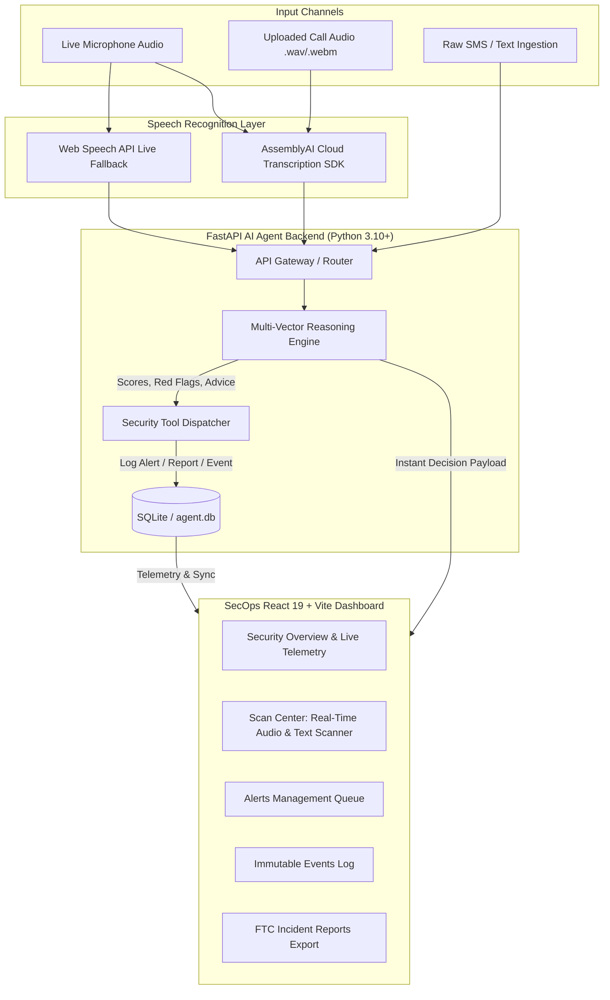

# VoiceShield AI — Real-Time Autonomous Scam Call Defender

[](https://fastapi.tiangolo.com)
[](https://react.dev/)
[](https://vitejs.dev/)
[](https://www.assemblyai.com/)
[](https://www.sqlite.org/)
[](./LICENSE)

> **VoiceShield AI** (ScamShield SecOps) is an enterprise-grade cyber defense and conversational AI platform engineered to detect, intercept, and neutralize fraudulent voice calls, vishing attacks, and predatory SMS phishing in real time before victims lose money or credentials.

---

## Table of Contents

- [Overview](#-overview)
- [System Architecture](#-system-architecture)
- [Key Features](#-key-features)
- [Scam Detection Vectors](#-scam-detection-vectors)
- [Tech Stack](#-tech-stack)
- [Repository Structure](#-repository-structure)
- [Getting Started](#-getting-started)
  - [Prerequisites](#prerequisites)
  - [1-Click Quickstart (Windows)](#1-click-quickstart-windows)
  - [Manual Local Setup](#manual-local-setup)
- [API Reference](#-api-reference)
- [Production Deployment](#-production-deployment)
- [License](#-license)

---

## Overview

Phone fraud and voice phishing (vishing) rob billions from everyday consumers each year. Traditional anti-spam apps rely on static, outdated blocklists that fail against caller-ID spoofing and newly minted scam operations.

**VoiceShield AI** solves this at the conversation layer:

1. **Live Audio Ingestion:** Listens to incoming call audio via Web Speech API and high-fidelity **AssemblyAI** cloud transcription.
2. **Multi-Vector AI Reasoning:** Scans conversational tokens in real time against known fraud typologies (IRS impersonation, fake banking OTPs, AnyDesk remote takeovers, grandchild bail emergencies, and gift-card extortion).
3. **Dynamic 0–100 Threat Index:** Calculates risk scores instantly, highlights syntax triggers, extracts red flags, and displays decisive directives (e.g. _“DO NOT PAY. HANG UP IMMEDIATELY”_).
4. **SecOps Incident Response:** Dispatches alerts to an active SOC dashboard and auto-generates FTC and law-enforcement-ready incident reports.

---

## System Architecture



---

## Key Features

- **Real-Time Audio Interception:** Stream microphone input or upload recorded call files (`.webm`, `.mp3`, `.wav`) for immediate transcription via AssemblyAI.
- **Multi-Vector Reasoning Engine:** Token-level semantic scanner capable of identifying pressure tactics, urgency markers, and extortion schemes in milliseconds (<150ms latency).
- **Dynamic 0–100 Risk Scoring:** Live animated circular threat gauge categorized into _Clean_, _High Risk_, or _Critical Danger_.
- **Syntactic NLP Highlighting:** Highlights malicious trigger words (e.g., _“arrest warrant”_, _“gift cards”_, _“bitcoin ATM”_, _“wire transfer”_) directly inside the audio transcript.
- **Acoustic Alert System:** Web Audio API sound triggers an audible warning tone whenever an active high-risk scam is intercepted.
- **Law Enforcement Incident Reports:** Automatically structures threat transcripts into FTC-compliant incident documentation exportable for legal reporting.
- **SecOps Hub Dashboard:** Real-time system health metrics, 24-hour scam trends donut charts, filterable alert queues, and immutable event logs.

---

## Scam Detection Vectors

The reasoning engine classifies incoming communication against specialized heuristic models:

| Category                         | Typical Threat Indicators                                         | Weight |
| -------------------------------- | ----------------------------------------------------------------- | :----: |
| **Government Impersonation**     | IRS, FBI, arrest warrant, federal marshal, suspended SSN          |   35   |
| **Financial & Banking Fraud**    | Unauthorized wire transfer, Western Union, Bitcoin ATM, Zelle     |   30   |
| **Credential & OTP Theft**       | One-time password, 2FA code, verification PIN, login prompt       |   35   |
| **Gift Card Coercion**           | Apple gift card, Target card, retail scratch-off digits           |   40   |
| **Tech Support / Remote Access** | AnyDesk, TeamViewer, virus detected, Microsoft Support            |   30   |
| **Urgency & Threat Coercion**    | _"Within 15 minutes"_, _"Do not hang up"_, _"Pay or face arrest"_ |   20   |
| **Prize / Refund Phishing**      | Amazon refund, overcharged subscription, sweepstakes release fee  |   25   |
| **Family Emergency Scams**       | Grandchild in jail, emergency bail, _"Don't tell mom & dad"_      |   35   |

---

## Tech Stack

### Frontend

- **Framework:** React 19 + Vite
- **Styling:** Custom Tactical Dark Theme & Vanilla CSS / Modern UI tokens
- **Audio:** Web Audio API (Live synthesizer tone), Web Speech API, MediaRecorder API
- **Icons:** Google Material Symbols Outlined

### Backend

- **Framework:** FastAPI (Python 3.10+)
- **Speech-to-Text:** AssemblyAI Python SDK
- **Database ORM:** SQLAlchemy with SQLite (`agent.db`)
- **Validation:** Pydantic v2
- **Server:** Uvicorn (ASGI)

---

## Repository Structure

```
VoiceShield-Real-Time-AI-Scam-Call-Defender/
├── run_local.bat                     # 1-Click launcher for Windows (Backend + Frontend)
├── package.json                      # Workspace root build scripts
├── render.yaml                       # Blueprint configuration for Render deployment
├── DEPLOYMENT.md                     # Production deployment documentation
├── LICENSE                           # MIT License
├── agent.db                          # Pre-seeded SQLite database
│
├── AI-Agent-Backend/                 # FastAPI Service
│   ├── app/
│   │   ├── main.py                   # REST API routes & CORS setup
│   │   ├── reasoning_engine.py       # Multi-vector heuristic scam scoring
│   │   ├── assembly_agent.py         # AssemblyAI transcriber integration
│   │   ├── models.py                 # SQLAlchemy database schema
│   │   ├── schemas.py                # Pydantic models
│   │   ├── database.py               # Database engine & session maker
│   │   └── tools.py                  # Alert, report, and event dispatch tools
│   ├── requirements.txt              # Backend dependencies
│   ├── .env.example                  # Backend environment template
│   └── test_suite.py                 # Backend unit & integration tests
│
└── AI-Agent-Frontend/                # React Dashboard Application
    ├── src/
    │   ├── App.jsx                   # ScamShield SecOps Suite Dashboard
    │   ├── main.jsx                  # Application entry point
    │   └── index.css                 # Dark tactical design system
    ├── index.html                    # HTML shell
    ├── package.json                  # Frontend dependencies
    └── vite.config.js                # Vite build config
```

---

## Getting Started

### Prerequisites

- **Python:** 3.10 or higher
- **Node.js:** 18.0 or higher
- **AssemblyAI API Key:** (Free tier available at [assemblyai.com](https://www.assemblyai.com))

---

### 1-Click Quickstart (Windows)

Double-click `run_local.bat` in the root folder, or run in terminal:

```cmd
run_local.bat
```

This will automatically:

1. Boot the FastAPI backend at `http://localhost:8000`
2. Boot the Vite frontend dev server at `http://localhost:5173`
3. Launch your default browser directly into the dashboard.

---

### Manual Local Setup

#### Step 1: Configure Backend

```bash
cd AI-Agent-Backend

# 1. Create and activate a Python virtual environment
python -m venv venv
# On Windows:
venv\Scripts\activate
# On macOS/Linux:
# source venv/bin/activate

# 2. Install dependencies
pip install -r requirements.txt

# 3. Create .env configuration
cp .env.example .env
```

Edit `AI-Agent-Backend/.env`:

```ini
ASSEMBLYAI_API_KEY=your_assemblyai_api_key_here
DATABASE_URL=sqlite:///./agent.db
```

Start the FastAPI server:

```bash
uvicorn app.main:app --reload --port 8000
```

_API will run at `http://localhost:8000` (Swagger docs: `http://localhost:8000/docs`)._

#### Step 2: Configure Frontend

In a new terminal window:

```bash
cd AI-Agent-Frontend

# 1. Install Node packages
npm install

# 2. Verify environment variable
# (defaults to http://localhost:8000 if not set)
echo VITE_API_BASE_URL=http://localhost:8000 > .env

# 3. Run development server
npm run dev
```

Visit **`http://localhost:5173`** in your browser.

---

## API Reference

| Method   | Endpoint               | Description                                                                            |
| -------- | ---------------------- | -------------------------------------------------------------------------------------- |
| `GET`    | `/`                    | API service health check                                                               |
| `GET`    | `/stats`               | Aggregated telemetry counts (alerts, active threats, events, reports)                  |
| `POST`   | `/agent/query`         | Analyzes text payload for scam intent, triggers tools & returns risk index             |
| `POST`   | `/agent/voice`         | Uploads audio recording (`.webm`, `.wav`), transcribes via AssemblyAI, & scores threat |
| `GET`    | `/alerts`              | Returns list of all detected security alerts                                           |
| `PATCH`  | `/alerts/{id}/resolve` | Marks an active alert as resolved                                                      |
| `DELETE` | `/alerts/{id}`         | Deletes a specific alert                                                               |
| `DELETE` | `/alerts`              | Clears all alerts from database                                                        |
| `GET`    | `/events`              | Retrieves audit event ledger                                                           |
| `GET`    | `/reports`             | Retrieves generated incident reports                                                   |

### Sample Query Payload

```bash
curl -X POST "http://localhost:8000/agent/query" \
     -H "Content-Type: application/json" \
     -d '{"message": "IRS notice: pay outstanding $4,850 via Apple Gift Cards or police will arrest you."}'
```

**Response:**

```json
{
  "decision": "scam_detected",
  "action": "send_alert",
  "severity": "critical",
  "risk_score": 95,
  "scam_category": "Government / Police Impersonation",
  "red_flags": [
    "Government / Police Impersonation: 'irs'",
    "Gift Card Coercion: 'gift card'",
    "Urgency & Threat Coercion: 'pay or face arrest'"
  ],
  "recommended_action": "Government agencies will NEVER call you demanding immediate payment or threatening arrest. Hang up immediately.",
  "response_text": "🚨 CRITICAL threat logged to defender database"
}
```

---

## Production Deployment

Refer to [`DEPLOYMENT.md`](./DEPLOYMENT.md) for full deployment instructions:

- **Render Blueprint (Zero-Docker 1-Click):** Uses [`render.yaml`](./render.yaml) to host both the Python web service and Vite static site.
- **Vercel + Railway / Render:** Host frontend on Vercel with `VITE_API_BASE_URL` pointing to backend.
- **Traditional Linux VPS:** Host using `systemd` or PM2 with Nginx reverse proxy.

---

## License

This project is licensed under the MIT License - see the [LICENSE](./LICENSE) file for details.
